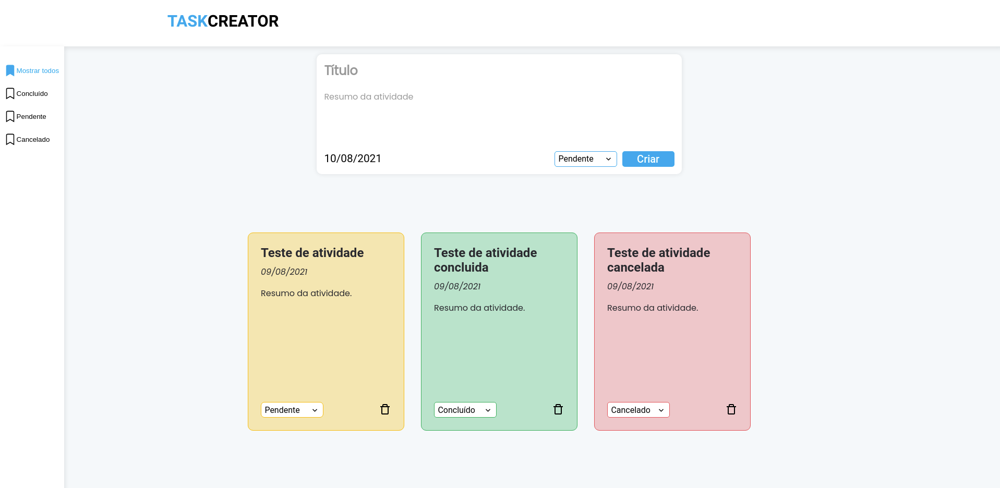

<p align="center">
  
</p>

<p align="center">
  
</p>

<br>

## 🧪 Tecnologias

Esse projeto foi desenvolvido com as seguintes tecnologias:

- [Yarn](https://yarnpkg.com/)
- [Next](https://nextjs.org/)
- [Firebase](https://firebase.google.com/)
- [TypeScript](https://www.typescriptlang.org/)

## 🚀 Como executar

Clone o projeto e acesse a pasta do mesmo.

```bash
$ git clone https://github.com/CesarNeo/challenge-task-creator.git
$ cd challenge-task-creator
```

Para iniciá-lo, siga os passos abaixo:
```bash
# Instalar as dependências
$ yarn

# Iniciar o projeto
$ yarn build

$ yarn start
```
O app estará disponível no seu browser pelo endereço http://localhost:3000.

Lembrando que será necessário criar uma conta no [Firebase](https://firebase.google.com/) e um projeto para disponibilizar um Realtime Database.

## 💻 Projeto

TASKCREATOR é um site para criar um registro de atividades por data. 

Este é um projeto desenvolvido para um teste de uma empresa.

Também é possível acessar o projeto hospedado no Firebase clicando aqui: [TASKCREATOR](https://611293af21764b39b84fccf1--frosty-dubinsky-0695b2.netlify.app/).

Feito com 💜 by Cesar Emmanuel 👋🏻
